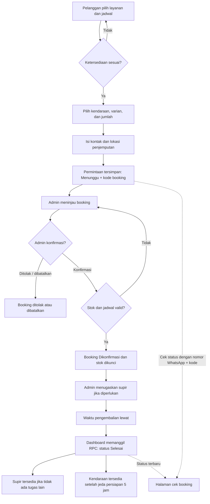

# Rencana Anggaran Biaya (RAB)
## Website Rental Mobil PT Khalisa Sumber Rezeki

**Tanggal penyusunan:** 2 Oktober 2026  
**Jenis anggaran:** Estimasi jasa pembuatan dan implementasi website, satu kali (one-time)  
**Nilai jasa:** **Rp2.500.000**  
**Status domain khusus:** Tidak termasuk

> Dokumen ini adalah estimasi penawaran jasa berdasarkan ruang lingkup fitur website yang tercantum, bukan bukti biaya historis atau invoice pembayaran. Total Rp2.500.000 hanya untuk jasa; biaya pembelian domain dan tagihan provider dibayar terpisah.

## Ringkasan Anggaran

| No. | Uraian pekerjaan | Estimasi waktu | Tarif dasar | Jumlah |
|---:|---|---:|---:|---:|
| 1 | Analisis kebutuhan dan alur bisnis | 4 jam | Rp50.000 | Rp200.000 |
| 2 | Desain UI/UX dan penyesuaian responsif | 5 jam | Rp60.000 | Rp300.000 |
| 3 | Halaman publik, katalog, dan detail kendaraan | 9 jam | Rp50.000 | Rp450.000 |
| 4 | Formulir booking, validasi, perhitungan, dan alur WhatsApp | 8 jam | Rp50.000 | Rp400.000 |
| 5 | Dashboard admin dan pengelolaan operasional | 10 jam | Rp50.000 | Rp500.000 |
| 6 | Integrasi Supabase dan kontrol akses aplikasi | 6 jam | Rp50.000 | Rp300.000 |
| 7 | Pengujian, perbaikan bug, dan pemeriksaan tampilan perangkat | 4 jam | Rp50.000 | Rp200.000 |
| 8 | Konfigurasi deployment, dokumentasi, dan serah terima | 3 jam | Rp50.000 | Rp150.000 |
|  | **Total estimasi jasa (49 jam)** |  |  | **Rp2.500.000** |

Rata-rata nilai jasa pada estimasi ini sekitar **Rp51.000 per jam**. Jam kerja merupakan dasar penyusunan anggaran, bukan pencatatan timesheet aktual.

### Pemisahan total biaya

| Komponen | Biaya dalam RAB | Keterangan |
|---|---:|---|
| Jasa analisis, desain, pembuatan, integrasi, pengujian, dan serah terima | Rp2.500.000 | Biaya satu kali sesuai rincian di atas. |
| Domain khusus, misalnya `namabisnis.com` atau `namabisnis.id` | Tidak termasuk | Pemilik membeli langsung melalui registrar. Biaya dan perpanjangan bergantung ekstensi dan registrar. |
| Vercel, Supabase, dan Geoapify | Tidak ditagihkan dalam RAB ini | Diasumsikan memakai kuota/paket yang tersedia. Tagihan berbayar, jika ada, dibayar langsung ke provider. |
| Pajak | Belum dihitung | Ditambahkan bila berlaku sesuai status penyedia jasa dan ketentuan perpajakan. |
| **Jumlah jasa yang ditawarkan** | **Rp2.500.000** | **Belum termasuk domain, tagihan provider, dan pajak yang mungkin berlaku.** |

## Rincian Lingkup Pekerjaan

### 1. Analisis kebutuhan dan alur bisnis — Rp200.000

- **Aktivitas:** inventarisasi halaman dan peran pengguna (2 jam × Rp50.000 = Rp100.000); pemetaan proses booking serta keputusan admin (1 jam × Rp50.000 = Rp50.000); penetapan daftar kebutuhan dan batas pekerjaan (1 jam × Rp50.000 = Rp50.000).
- **Hasil:** daftar halaman, kebutuhan pelanggan/admin, urutan status booking, dan batas fitur yang masuk ke estimasi.

### 2. Desain UI/UX dan penyesuaian responsif — Rp300.000

- **Aktivitas:** struktur halaman dan hierarki informasi (2 jam × Rp60.000 = Rp120.000); penataan komponen publik dan admin (2 jam × Rp60.000 = Rp120.000); penyesuaian breakpoint desktop/ponsel (1 jam × Rp60.000 = Rp60.000).
- **Hasil:** sistem tampilan yang diterapkan pada halaman publik, form booking, dan dashboard; bukan paket file desain terpisah di Figma.

### 3. Halaman publik, katalog, dan detail kendaraan — Rp450.000

- **Aktivitas:** beranda, navigasi, dan bagian informasi usaha (2 jam × Rp50.000 = Rp100.000); katalog, filter kategori, dan pengelompokan model (2 jam × Rp50.000 = Rp100.000); kartu/detail kendaraan beserta varian, stok, dan harga (3 jam × Rp50.000 = Rp150.000); halaman syarat dan ketentuan serta cek booking (2 jam × Rp50.000 = Rp100.000).
- **Hasil:** halaman publik yang menampilkan armada dari data Supabase dan menyediakan halaman informasi serta cek status.

### 4. Formulir booking dan alur WhatsApp — Rp400.000

- **Aktivitas:** pilihan layanan, tanggal, jam, dan durasi (2 jam × Rp50.000 = Rp100.000); pilihan model, varian, jumlah, dan kalkulasi harga (2 jam × Rp50.000 = Rp100.000); validasi pemesan, nomor telepon, dan lokasi jemput (2 jam × Rp50.000 = Rp100.000); penyimpanan booking, kode booking, dan tautan WhatsApp (2 jam × Rp50.000 = Rp100.000).
- **Hasil:** pelanggan dapat mengirim permintaan booking dengan rincian kendaraan dan estimasi harga. Ini bukan pembayaran atau konfirmasi otomatis.

### 5. Dashboard admin dan pengelolaan operasional — Rp500.000

- **Aktivitas:** akses dashboard dan sesi admin (2 jam × Rp50.000 = Rp100.000); pemrosesan booking serta penugasan supir (3 jam × Rp50.000 = Rp150.000); CRUD armada/foto dan profil supir (3 jam × Rp50.000 = Rp150.000); ringkasan keuangan, ekspor CSV, dan pengelolaan admin (2 jam × Rp50.000 = Rp100.000).
- **Hasil:** dashboard `/admin` untuk operasional. Booking yang melewati waktu kembali ditandai Selesai saat dashboard dimuat/refresh; bukan proses latar belakang saat dashboard tertutup.

### 6. Integrasi Supabase dan kontrol akses — Rp300.000

- **Aktivitas:** konfigurasi koneksi frontend dan environment (1 jam × Rp50.000 = Rp50.000); integrasi autentikasi/role admin (1 jam × Rp50.000 = Rp50.000); alur baca/tulis katalog, booking, supir, dan foto (2 jam × Rp50.000 = Rp100.000); integrasi RPC ketersediaan, konfirmasi, dan status booking (2 jam × Rp50.000 = Rp100.000).
- **Hasil:** antarmuka terhubung dengan Supabase yang telah dikonfigurasi. Anggaran mengasumsikan schema, RLS, Storage, dan RPC backend tersedia; membuat ulang database atau memulihkan file migration tidak termasuk.

### 7. Pengujian dan perbaikan — Rp200.000

- **Aktivitas:** build dan pemeriksaan kode (1 jam × Rp50.000 = Rp50.000); pengujian alur booking/admin dan validasi dasar (2 jam × Rp50.000 = Rp100.000); pemeriksaan tampilan ponsel/desktop dan perbaikan dalam lingkup (1 jam × Rp50.000 = Rp50.000).
- **Hasil:** aplikasi lolos pemeriksaan build dan alur utama diperiksa. Uji penetrasi, load test, dan audit keamanan formal tidak termasuk.

### 8. Deployment dan serah terima — Rp150.000

- **Aktivitas:** konfigurasi build/deployment frontend (1 jam × Rp50.000 = Rp50.000); dokumentasi penggunaan dan catatan konfigurasi (1 jam × Rp50.000 = Rp50.000); serah terima source code dan akses yang disepakati (1 jam × Rp50.000 = Rp50.000).
- **Hasil:** source code, panduan admin, deployment frontend sesuai akses yang tersedia, dan garansi perbaikan bug 30 hari. Pendaftaran domain khusus bukan bagian dari pos ini.

## Alur Kerja Website

### Alur booking dari pelanggan sampai selesai

1. **Pelanggan memilih layanan dan jadwal.** Pelanggan memilih sewa dengan atau tanpa supir, tanggal, jam mulai, dan durasi. Sistem memeriksa ketersediaan supir bila layanan memakai supir.
2. **Pelanggan memilih kendaraan.** Katalog menampilkan kendaraan dan varian yang sesuai. Pelanggan memilih transmisi/jenis mesin serta jumlah unit; harga dan subtotal dihitung sebelum permintaan dikirim.
3. **Pelanggan mengisi data dan mengirim permintaan.** Nama, nomor WhatsApp, dan lokasi penjemputan divalidasi. Sistem menyimpan permintaan berstatus **Menunggu**, beserta jadwal, snapshot kendaraan/harga, dan kode booking. Tautan WhatsApp disediakan untuk komunikasi lanjutan.
4. **Admin memeriksa permintaan.** Admin meninjau jadwal, armada, dan kebutuhan supir di dashboard. Booking Menunggu belum mengunci stok.
5. **Admin mengonfirmasi atau menolak.** Saat dikonfirmasi, sistem memeriksa kapasitas sekali lagi. Jika jadwal atau stok bentrok, booking tetap Menunggu sampai admin menghubungi pelanggan. Jika lolos, status menjadi **Dikonfirmasi** dan unit dikunci untuk jadwal tersebut.
6. **Admin menugaskan supir bila diperlukan.** Penugasan dilakukan terpisah dari konfirmasi booking. Sistem mencegah supir ditugaskan pada jadwal yang bertabrakan; admin dapat mengirim detail tugas melalui WhatsApp.
7. **Booking selesai setelah jadwal pengembalian lewat.** Saat dashboard dimuat atau refresh berkala berjalan, booking Dikonfirmasi yang `end_at`-nya telah lewat dikirim ke RPC untuk diubah menjadi **Selesai**. Jika dashboard tertutup, pemrosesan berlangsung saat dashboard dibuka kembali. Ini berdasarkan jadwal dan tidak menggantikan pemeriksaan fisik kendaraan oleh admin.
8. **Ketersediaan diperbarui.** Setelah booking selesai, supir dapat kembali **Tersedia** jika tidak memiliki tugas lain yang sedang berlangsung. Kendaraan memiliki jeda persiapan **5 jam** setelah jadwal pengembalian sebelum dapat disewa lagi.
9. **Pelanggan mengecek status.** Pelanggan membuka halaman cek booking dan memasukkan nomor WhatsApp serta kode booking untuk melihat status, jadwal, kendaraan, dan estimasi biaya.

**Catatan otomatisasi:** perubahan booking ke Selesai dan sinkronisasi status supir berjalan ketika dashboard admin melakukan pemuatan/refresh. Keduanya belum dijalankan oleh scheduler/server saat dashboard tertutup.

## Biaya Operasional di Luar Jasa

Biaya berikut **tidak termasuk** dalam total jasa Rp2.500.000. Nilai aktual mengikuti provider, pilihan paket, pemakaian, dan tanggal pembelian.

| Komponen | Perkiraan perlakuan biaya | Catatan |
|---|---|---|
| Domain | Biaya tahunan, mengikuti registrar dan ekstensi domain | Domain adalah biaya berulang; harga perlu dikonfirmasi sebelum pembelian. |
| Hosting frontend Vercel | Dapat mulai dari paket gratis jika memenuhi ketentuan dan kuota provider | Biaya dapat berubah jika penggunaan atau kebutuhan melewati batas paket. |
| Database, autentikasi, dan penyimpanan Supabase | Dapat mulai dari paket gratis jika memenuhi ketentuan dan kuota provider | Biaya dapat timbul untuk kapasitas atau pemakaian tambahan. Foto disimpan di Storage. |
| API pencarian alamat Geoapify | Mengikuti kuota dan paket provider | Penggunaan berlebih atau kebutuhan komersial tertentu dapat dikenakan biaya. |
| WhatsApp | Tautan `wa.me` untuk membuka aplikasi WhatsApp | Bukan integrasi WhatsApp Business API; pesan otomatis tanpa klik tidak termasuk. |

## Kenapa Nilainya Bisa Rp2.500.000?

1. **Ini harga jasa dengan lingkup yang dibatasi**, bukan biaya berlangganan atau harga infrastruktur khusus. Anggaran dibagi ke delapan kelompok pekerjaan dengan estimasi 49 jam.
2. **Teknologi yang digunakan sudah tersedia dan banyak yang open source**, seperti React, Vite, dan Tailwind CSS. Pengerjaan tidak memerlukan pembelian lisensi framework.
3. **Layanan backend dan hosting menggunakan platform terkelola**, yaitu Supabase dan Vercel. Pendekatan ini mengurangi kebutuhan membangun dan merawat server sendiri.
4. **Alur komunikasi WhatsApp menggunakan tautan**, bukan chatbot atau WhatsApp Business API yang memerlukan setup dan biaya tambahan.
5. **Tidak ada gateway pembayaran online** pada lingkup ini. Booking dikirim sebagai permintaan, kemudian dikonfirmasi admin.
6. **Estimasi ini mengasumsikan data, foto kendaraan, identitas merek, dan project Supabase tersedia dari pemilik.** Perancangan identitas merek, produksi foto, migrasi data besar, dan rekonstruksi backend tidak dihitung.
7. **Harga ini tergolong hemat untuk fitur yang tercantum.** Nilainya dapat tercapai dengan penggunaan komponen yang konsisten, pengerjaan langsung pada satu aplikasi, dan tanpa kebutuhan sistem enterprise atau dukungan berkelanjutan di luar masa garansi.

## Tidak Termasuk

- Pembelian domain, paket hosting berbayar, kuota API berbayar, dan biaya provider lainnya.
- Biaya pajak yang mungkin berlaku sesuai status penyedia jasa dan aturan perpajakan.
- WhatsApp Business API, notifikasi otomatis, SMS, email transaksional berbayar, atau chatbot.
- Pembayaran online, refund otomatis, invoice akuntansi, dan rekonsiliasi pembayaran.
- Aplikasi native Android/iOS, aplikasi untuk supir, GPS tracking, atau integrasi peta berbayar.
- Pembuatan konten, copywriting profesional, foto/video kendaraan, dan desain logo baru.
- Pemulihan atau pembuatan ulang migration database Supabase yang tidak tersedia pada checkout ini.
- Fitur baru, perubahan besar setelah serah terima, dan dukungan rutin setelah masa garansi.

## Asumsi dan Ketentuan

- Pemilik menyediakan akses yang diperlukan ke project Vercel, Supabase, domain, dan Geoapify. Kredensial rahasia tidak disimpan di source code publik.
- Project Supabase sudah memiliki schema, kebijakan RLS, Storage, dan fungsi database yang sesuai. Checkout source saat ini tidak menyertakan file migration; konfigurasi database produksi perlu diverifikasi sebelum deployment.
- Perubahan dalam masa garansi terbatas pada perbaikan bug yang dapat direproduksi pada fitur yang tercantum. Penambahan atau perubahan kebutuhan diperkirakan terpisah.
- Nilai jasa dapat berubah jika ruang lingkup, jumlah integrasi, kebutuhan keamanan, atau kebutuhan migrasi data berubah.